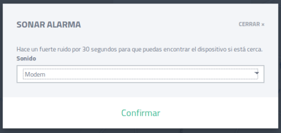

title: Prey – Software antirobo
date: 2018/09/18
category: Cajón desastre
tags: Extra

Hoy os traigo una aplicación antirobo muy util y económica llamada Prey, nos permite saber la ubicación de nuestros dispositivos en todo momento y además cuenta con varias funciones extras.

En esa ocación simularemos la perdida de un dispositivo móvil y veremos como utilizar la versión gratuita de esta magnifica aplicación para saber donde se encuentra.

Lo primero que debemos hacer es registrarnos en la pagina web y añadir nuestro dispositivo móvil después de haberle instalado la app de [prey](https://preyproject.com/).

Si hacemos clic en el dispositivo que hemos añadido aparecerá el menú acciones, en la parte superior derecha con diversas opciones.

Elegimos la opción de sonar alarma para que el móvil suene con el tono que deseemos durante 30 segundos y así asegurarnos que se encuentra en las proximidades.

La opción de Enviar mensaje, como su propio nombre indica envía un mensaje a nuestro móvil que aparecerá en pantalla sin necesidad de estar desbloqueado.

Tras activar el modo camuflado se esconde el icono Prey cuando la aplicación sea abierta.

Esta opción nos permite bloquear el móvil hasta que se ingrese la contraseña correcta.

Por ultimo, prey nos permite especificar una zona geográfica en concreto, de esta forma cuando el dispositivo móvil entre o salga de dicha zona nos enviará una advertencia. Hacemos clic en Agregar nueva zona y le aumentamos el radio de acción.

