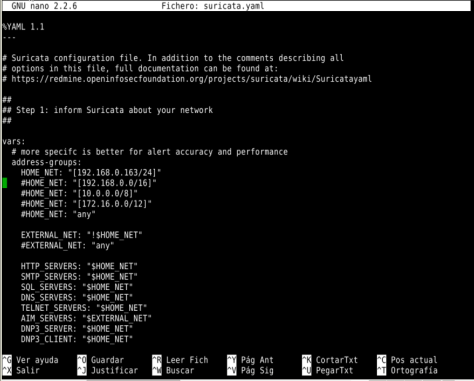
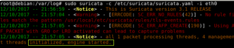
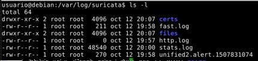
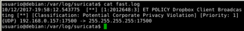
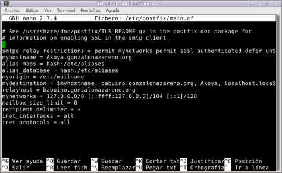
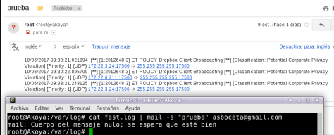

title: Instalación y configuración de Suricata
date: 2018/09/12
category: Seguridad
tags: Linux

Suricata es una herramienta gratuita y de código libre que se ha desarrollado para controlar el tráfico de red y su principal objetivo es rastrear o buscar  eventos de seguridad que puedan indicar un ataque o posible intrusión en un servidor o en algún equipo de la red.

En este apartado veremos como instalar suricata desde nuestra terminal en la distribución Debian.

Primero debemos realizar una pre-instalación de los paquetes necesarios para su configuración.

#Pre-instalación

~~~
    apt-get -y install libpcre3 libpcre3-dbg libpcre3-dev \

    build-essential autoconf automake libtool libpcap-dev libnet1-dev \

    libyaml-0-2 libyaml-dev zlib1g zlib1g-dev libmagic-dev libcap-ng-dev \

    libjansson-dev pkg-config
~~~

De forma predeterminada, Suricata funciona como un IDS. Para utilizarlo como un programa IDS e IPS instalamos:

*apt-get -y install libnetfilter-queue-dev*

#Instalación

Nos movemos a la carpeta deseada en la que descargaremos el paquete de suricata, lo extraemos y nos situamos en la carpeta extraida.

~~~
    wget http://www.openinfosecfoundation.org/download/suricata-3.1.tar.gz

    tar -xvzf suricata-3.1.tar.gz

    cd suricata-3.1
~~~

Pasamos a compilar e instalar el paquete junto con las reglas.

~~~
    ./configure –prefix=/usr –sysconfdir=/etc –localstatedir=/var

    make

    make install-full

~~~

Cuando haya acabado este proceso nos aseguramos que las siguientes carpetas se encuentran en nuestro equipo, si no las creamos.
~~~
    sudo mkdir /var/log/suricata

    sudo mkdir /etc/suricata
~~~
Copiamos los ficheros de configuración de la carpeta que hemos extraído en la carpeta /etc/suricata.
~~~
    sudo cp classification.config /etc/suricata

    sudo cp reference.config /etc/suricata

    sudo cp suricata.yaml /etc/suricata
~~~

#Configuración

A continuación editamos el fichero suricata.yaml asegurándonos de que cada variable de los vars, grupos de direcciones y grupos de puertos en el archivo yaml está configurado correctamente respecto a nuestras necesidades.

+ Debemos establecer la dirección ip de la red local en HOME_NET.
+ Se recomienda establecer EXTERNAL_NET en !$HOME_NET. De esta forma, cada dirección IP establecida en HOME_NET se tratará como externa.
+ HTTP_SERVERS, SMTP_SERVERS, SQL_SERVERS, DNS_SERVERS y TELNET_SERVERS se establecen de forma predeterminada en HOME_NET.
+ AIM_SERVERS se establece por defecto en ‘any’.

Estas variables deben configurarse para los servidores de su red. Todos los ajustes tienen que ser configurados para que tenga un efecto más preciso.

#Utilización

Ejecutamos suricata mediante la siguiente expresión:

    suricata -c /etc/suricata/suricata.yaml -i eth0

Veremos algunos errores con el parseado de algunas reglas, pero una vez que se inicie el motor (engine started), estará funcionado:

Las alertas se almacenan en /var/log/suricata y se crean los siguientes ficheros:

+ fast.log
+ http.log
+ stat.log
+ alertas unified2

Si abrimos el fichero fast.log veremos una alerta que ha sido activada el 10/12/2017 a las 19.58 por la aplicación Dropbox.

Por último, vamos a hacer que se envíe dicho fichero cada cierto tiempo a nuestro correo para mantener un mayor control de las alertas, para ellos necesitamos instalar:

~~~
    apt-get install postfix

    apt-get install mailutils
~~~

Modificamos el apartado mydestination del fichero /etc/postfix/main.cf

En este caso como vamos a enviar el correo desde un instituto, añadimos la dirección de babuino.gonzalonazareno.org. Ponga usted la que requerida en su entorno de trabajo.

Luego con el comando cat fast.log | mail -s “asunto” correoelectronico enviamos el mensaje.

Pero lo aconsejable es que esta función la realice cada cierto tiempo automáticamente, por ello crearemos un script, le damos un nombre y lo ejecutamos cada 3 dias.

    30 19 */3 * * root /mail.sh
~~~
    #! \bin\bash

    user=$(whoami)

    if [[ $user = “root” ]]

    then

    cd /var/log/suricata/

    echo “Hola, dime el correo al cual enviar las alertas de suricata”

    read correo

    if [[ $correo =~ @ ]]

    then

    echo “Asunto:”

    read asunto

    cat fast.log | mail -s “$asunto” $correo

    else

    echo “Ese correo no tiene buena pinta”

    fi

    else

    echo “Tienes que ser root, cualquiera no me va a enviar mensajes”

    fi
~~~

**Nota:** Si te resulta muy complicado utilizar suricata desde la terminal puedes utilizar [Smooth-Sec](https://wordpress.com/read/feeds/53738596/posts/1967866159), es mucho más intutivo gracias a su interfaz gráfica.
