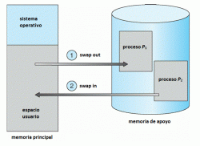
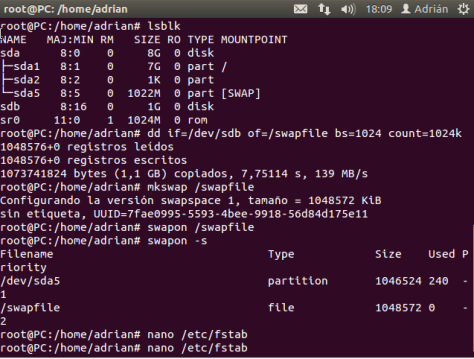
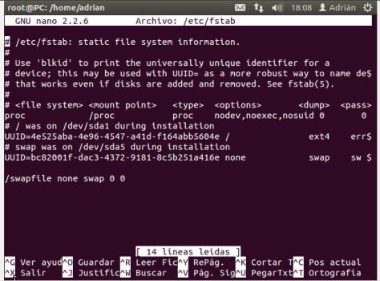
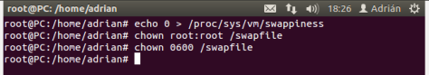
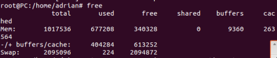
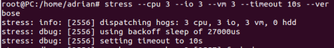
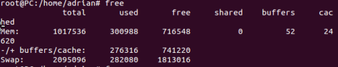

title: Configuración de SWAP
date: 2018/09/22
category: Sistemas
tags: Linux

En informática, el [espacio de intercambio ](https://es.wikipedia.org/wiki/Espacio_de_intercambio)es una zona del disco que se usa para guardar las imágenes de los procesos que no han de mantenerse en memoria física. A este espacio se le suele llamar swap.

Posiblemente en ocasiones nos interese cambiar la configuración de la swap, por ejemplo por motivos de rendimiento en el servidor o porque le hayamos puesto un tamaño erróneo durante la instalación del sistema operativo. Por estos u otros casos les traigo como crear y configurar una partición swap desde la terminal.

#Pasos a seguir

1. Vemos cuales son los discos que se encuentran en nuestro sistema con el comando lsblk, luego creamos nuestra swap con:

	*[dd if=/dev/zero of=/swapfile bs=1024 count=1024k](https://blog.desdelinux.net/uso-del-comando-dd/)*

2. Utilizamos el comando **mkswap /swapfile**, luego activamos la swap con el comando: **swapon /swapfile** y comprobamos que la partición swap ha sido creada y activada con el comando **swapon -s**.

	

	Para no perder la swap tras reiniciar, debemos editar el archivo fstab agregándole la siguiente linea:

	/*swapfile none swap sw 0 0*

	

3. Definimos la propiedad swappiness con el valor 0 utilizando el comando:

	*echo 0 > /proc/sys/vm/swappiness*

4. Asignamos los permisos correctos al archivo de swap para que no pueda ser leído o modificado por los usuarios, con los comandos:

	*chown root:root /swapfile
	chmod 0600 /swapfile*

	

5. Utilizamos el comando free para saber el uso de nuestra memoria y vemos que la swap solo esta utilizando 224 Kilobytes.

	

6. Ahora vamos a utilizar el comando stress para estresar al sistema y ver como este utiliza la swap, para ello escribimos:

	*stress –cpu 3 –io 3 –vm 3 –timeout 10s –verbose*

	

7. Por ultimo comprobamos como se ha disparado el uso de la swap tras cargar el sistema, como ha pasado de 224 Kilobytes a 282080 Kilobytes.

	
